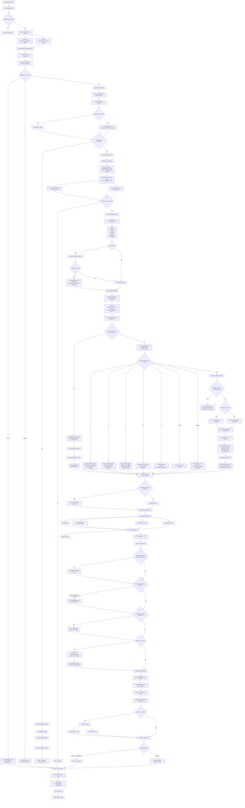

## Map

```mermaid
flowchart TD
    A["name_smiles(smiles)"] --> B["read_smiles(smiles)"]
    B --> C{"RDKit parsed molecule?"}
    C -- "No" --> D["Return empty Molecule"]
    C -- "Yes" --> E["Build custom Molecule graph"]

    E --> E1["Add atoms<br/>symbol, idx, charge, R/S stereo"]
    E --> E2["Add bonds<br/>order, E/Z stereo, small-ring flag"]
    E1 --> F["get_connected_components(mol)"]
    E2 --> F

    F --> G["For each connected component"]
    G --> H["name_component(mol, component_atoms)"]

    H --> I{"Single atom component?"}
    I -- "Metal" --> I1["Return element name<br/>sodium, potassium, calcium, etc."]
    I -- "Halogen" --> I2["Return halide name<br/>chloride, bromide, etc."]
    I -- "No" --> J["perceive_groups(mol)"]

    J --> K["Filter groups attached to this component"]
    K --> L["Find principal group candidates"]
    L --> M{"Naming as substituent?"}
    M -- "Yes" --> M1["principal_key = None"]
    M -- "No" --> M2["principal_key = suffixes.most_senior(candidates)"]

    M1 --> N{"Principal group is anhydride?"}
    M2 --> N

    N -- "Yes" --> N1["Special anhydride handling"]
    N1 --> N2["Find bridging oxygen"]
    N2 --> N3["Split into two acid halves"]
    N3 --> N4["Name each half recursively"]
    N4 --> N5["Return '<acid> anhydride' or mixed anhydride"]

    N -- "No" --> O["Initialize exclude_atoms"]
    O --> P["Adjust perceived groups"]
    P --> P1["Move non-principal carbonyl/cyano groups<br/>to prefix attachment when needed"]
    P1 --> Q["Exclude atoms not part of parent<br/>ester O, amide N, sulfonate S, etc."]

    Q --> R["find_all_carbon_paths(mol, exclude_atoms)"]
    Q --> S["find_ring_systems(mol, exclude_atoms)"]

    R --> T{"Any chains or rings found?"}
    S --> T
    T -- "No" --> T1["Return methane"]
    T -- "Yes" --> U["select_principal_parent(...)"]

    U --> U1["Choose best parent candidate"]
    U1 --> U2["Return:<br/>best_paths<br/>is_ring<br/>is_bicycle<br/>is_spiro<br/>is_polycycle<br/>xyz descriptors"]

    U2 --> V{"Parent is ring?"}
    V -- "Yes" --> V1["retained.get_retained_ring(...)"]
    V1 --> V2{"Valid retained name?"}
    V2 -- "Yes" --> V3["Use retained name and locant maps<br/>pyrrole, imidazole, indole, purine, etc."]
    V2 -- "No" --> V4["Use systematic parent"]
    V -- "No" --> V4

    V3 --> W["Build subst_mapping"]
    V4 --> W

    W --> W1["Collect non-principal functional groups as prefixes"]
    W1 --> W2["Examples:<br/>hydroxy, oxo, cyano, carboxy,<br/>carbamoyl, sulfo, nitro, halo, etc."]

    W2 --> X["Scan neighbors of every parent atom"]
    X --> X1{"Off-parent branch forms spiro substituent?"}
    X1 -- "Yes" --> X2["Build temporary sub_mol<br/>replace attachment atom with Si marker"]
    X2 --> X3["Name temporary molecule"]
    X3 --> X4["Extract silane marker locant"]
    X4 --> X5["Store placeholder:<br/>[SPIRO]-loc-name"]
    X1 -- "No" --> Y["name_subgraph(branch, exclude_atoms, upstream_atom)"]

    Y --> Y1{"Starts with simple hetero atom?"}

    Y1 -- "O" --> YO["Name oxygen substituent<br/>hydroxy, oxo, oxido, alkoxy,<br/>carbonyloxy, peroxy, sulfooxy"]
    Y1 -- "N" --> YN["Name nitrogen substituent<br/>amino, imino, nitrilo,<br/>substituted amino, acylamino"]
    Y1 -- "S" --> YS["Name sulfur substituent<br/>sulfanyl, thioxo, sulfinyl,<br/>sulfonyl, sulfonimidoyl,<br/>lambda notation"]
    Y1 -- "Se" --> YSE["Name selenium substituent<br/>selanyl, selenoxo, selanylidene"]
    Y1 -- "P" --> YP["Name phosphorus substituent<br/>phosphanyl, phosphoryl"]
    Y1 -- "Si or B" --> YSB["Name silyl or boryl substituent"]
    Y1 -- "Halogen" --> YH["Name fluoro, chloro, bromo, iodo<br/>or hypervalent halogen substituent"]
    Y1 -- "No" --> Y2["Collect connected subgraph"]

    Y2 --> Y3{"Subgraph contains recognized group?"}
    Y3 -- "Yes" --> Y4["Return group prefix<br/>nitro, azido, cyano, carboxy,<br/>carbamoyl, isocyanato, etc."]
    Y3 -- "No" --> Y5{"Subgraph starts in ring?"}

    Y5 -- "Yes" --> Y6["Find ring systems in subgraph"]
    Y5 -- "No" --> Y7["Find carbon paths in subgraph"]

    Y6 --> Y8["select_principal_parent(...) for substituent"]
    Y7 --> Y8

    Y8 --> Y9["number_parent(...) for substituent"]
    Y9 --> Y10["Build AssemblyParts with<br/>is_substituent=True<br/>attachment_locant<br/>single/double/triple attachment"]
    Y10 --> Y11["assemble_name(parts)"]
    Y11 --> Y12["Return substituent name<br/>methyl, phenyl, prop-2-enyl,<br/>cyclohexyl, ethylidene, etc."]

    YO --> Z["Add branch name to subst_mapping"]
    YN --> Z
    YS --> Z
    YSE --> Z
    YP --> Z
    YSB --> Z
    YH --> Z
    Y12 --> Z
    X5 --> Z

    Z --> AA{"Retained locant maps available?"}
    AA -- "Yes" --> AB["Choose best retained locant map"]
    AA -- "No" --> AC["number_parent(...)"]

    AB --> AD["Define get_loc(atom_idx)"]
    AC --> AD

    AD --> AE["Create AssemblyParts"]
    AE --> AE1["Parent length"]
    AE --> AE2["Ring / bicycle / spiro / polycycle flags"]
    AE --> AE3["Retained name, if any"]
    AE --> AE4["Polycycle descriptors"]

    AE1 --> AF["Add stereochemistry"]
    AE2 --> AF
    AE3 --> AF
    AE4 --> AF

    AF --> AF1["Atom R/S stereo"]
    AF --> AF2["_emit_bond_stereo(...) for E/Z"]
    AF2 --> AF3["Skip E/Z in small rings"]

    AF3 --> AG{"Retained heterocycle needing indicated H?"}
    AG -- "Yes" --> AG1["Add indicated hydrogens<br/>1H-, 2H-, etc."]
    AG -- "No" --> AH

    AG1 --> AH{"Principal group has front modifier?"}

    AH -- "Ester / carboxylate / sulfonate" --> AH1["Name alcohol/alkoxy part as front modifier"]
    AH -- "No" --> AI

    AH1 --> AI{"Principal group has N-substituents?"}

    AI -- "Yes" --> AI1["Name N-substituents<br/>N-, N'-, N''- locants"]
    AI -- "No" --> AJ

    AI1 --> AJ{"Retained name used?"}

    AJ -- "No" --> AJ1["Add heteroatom replacement prefixes<br/>oxa, aza, thia, sila, etc."]
    AJ1 --> AJ2["Add lambda notation if valence exceeds standard"]
    AJ -- "Yes" --> AK

    AJ2 --> AK["Add principal suffix group"]
    AK --> AK1["parts.principal_group = key + locants"]

    AK1 --> AL["Add substituents from subst_mapping"]
    AL --> AL1["Merge same substituent names"]
    AL1 --> AL2["Collect locants for repeated substituents"]

    AL2 --> AM{"Retained name used?"}
    AM -- "No" --> AM1["Add unsaturations"]
    AM1 --> AM2["Double bonds → ene"]
    AM1 --> AM3["Triple bonds → yne"]
    AM -- "Yes" --> AN

    AM2 --> AN["assemble_name(parts)"]
    AM3 --> AN

    AN --> AO{"Special correction?"}
    AO -- "name == 1-phenylbenzene" --> AO1["Return 1,1'-biphenyl"]
    AO -- "Otherwise" --> AP["Return assembled component name"]

    AP --> AQ["Back to name_smiles"]
    AO1 --> AQ
    I1 --> AQ
    I2 --> AQ
    N5 --> AQ
    T1 --> AQ

    AQ --> AR["Collect all component names"]
    AR --> AS["Sort names<br/>metals first, then alphabetically"]
    AS --> AT["Join with spaces"]
    AT --> AU["Final molecular name"]
```