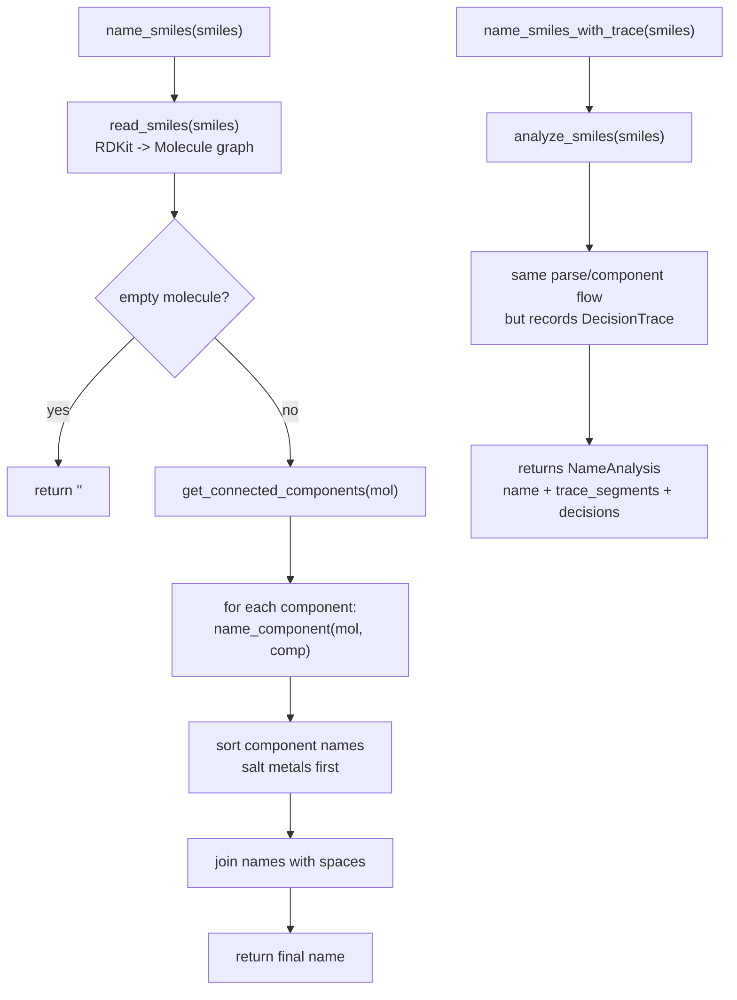
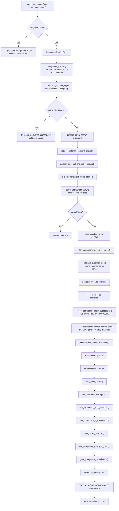
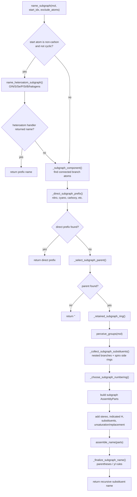
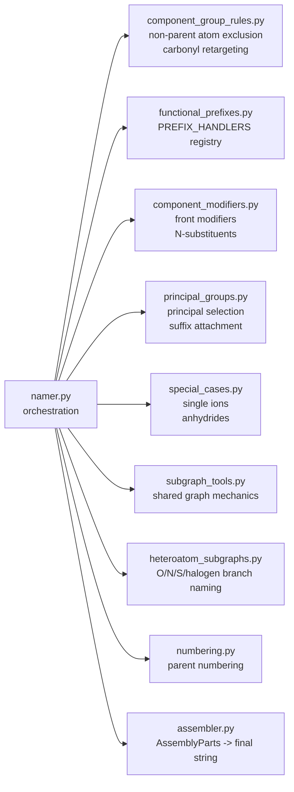

I assume “muramid” means a Mermaid diagram.

Below is the current flow of `openclatura/namer.py` after the refactor. At a high level, `namer.py` is now an orchestrator: it parses a molecule, splits it into graph components, names each component, recursively names substituent subgraphs when needed, then assembles the final name.

**Main Public Entry Points**

`name_smiles(smiles)` is the fast path. It parses the SMILES, splits the graph into connected components, names each component with `name_component`, sorts salt-like components so supported metals come first, and joins the component names.

`analyze_smiles(smiles)` does the same naming work but also records decision trace phases: parse, component split, functional-group perception, priority, parent selection, numbering, and final assembly.

`name_smiles_with_trace(smiles)` is a compatibility wrapper over `analyze_smiles`; it returns only `(name, trace_segments)`.

**Component Naming**

`name_component` is the core pipeline for one connected molecule component.

It first handles very small special cases. If the component is a single supported ion, it returns that directly. For example, `[Na+]` becomes `sodium`, and `[Cl-]` becomes `chloride`.

For normal components, it creates a `ComponentNamingState`. This state carries all the important intermediate data: component atoms, perceived groups, principal key, excluded atoms, selected parent, retained-name data, prefix groups, principal atoms, and exclusion sets for recursive substituent naming.

Functional groups are perceived first, then `principal_groups.py` chooses the senior principal group. That determines the suffix-bearing group, such as acid, alcohol, amide, nitrile, etc.

Then `component_group_rules.py` applies data-driven graph preprocessing:
- retargets some exocyclic carbonyl groups onto the parent atom,
- excludes non-parent linker atoms,
- computes principal involved atoms.

The parent skeleton is selected from carbon chains and ring systems. This delegates to `select_principal_parent`, which scores candidate chains/rings using the principal group and parent-selection rules.

Once a parent is selected, the code filters functional groups to only those attached to that parent, checks whether a retained ring name applies, computes substituent exclusions, collects prefixes and branches, chooses numbering, creates `AssemblyParts`, and finally calls `assemble_name(parts)`.

**Recursive Subgraph Naming**

`name_subgraph` names substituent branches attached to a parent atom. It is called from component prefix handling, ordinary branch substituent collection, N-substituent handling, front modifiers, and heteroatom recursive naming.

It first checks whether the branch starts with a non-carbon atom outside a ring. If so, it delegates to `heteroatom_subgraphs.py`, which handles names like hydroxy, oxo, amino, sulfanyl, halogen prefixes, and related heteroatom-substituent forms.

If that does not apply, it finds the connected subgraph for the branch. If the branch is exactly a known direct functional prefix, `_direct_subgraph_prefix` returns it immediately.

Otherwise it selects a parent for the subgraph, just like component naming does, but with substituent-specific constraints. It then collects nested substituents, handles spiro side-ring substituents, chooses numbering, builds `AssemblyParts`, assembles the name, and wraps it in parentheses when required.

**Where The Data-Driven Rules Live**

The major simplification is that `namer.py` no longer owns every group-specific decision inline.

`functional_prefixes.py` is the most data-driven example. Instead of a long `if/elif group.key` ladder in `namer.py`, it builds a `PREFIX_HANDLERS` registry from key groups loaded through `namer_config.py`. Adding a new prefix type should now usually mean adding a key to the data-backed category and, only when needed, adding one handler function.

`group_atom_roles.py` centralizes atom-role selectors. That prevents duplicated chemistry predicates like “find the ester single oxygen” or “find the amide nitrogen” from appearing in multiple naming steps.

`component_modifiers.py` owns post-parent modifier logic: front modifiers and N-substituents. It still receives `name_subgraph` as a callback, so it does not import `namer.py` and avoids circular dependencies.

**End-To-End Mental Model**

The code follows this chemistry pipeline:

1. Parse SMILES into a graph.
2. Split disconnected graph components.
3. For each component, perceive functional groups.
4. Pick the principal characteristic group.
5. Exclude functional-group atoms that should not be part of the parent skeleton.
6. Select the best parent chain/ring/polycycle.
7. Recompute principal/prefix groups against the selected parent.
8. Collect characteristic-group prefixes and ordinary substituent branches.
9. Number the parent.
10. Build `AssemblyParts`.
11. Add suffixes, prefixes, unsaturation, stereochemistry, retained names, and trace metadata.
12. Assemble the component name.
13. Sort disconnected component names and join them into the final molecule name.